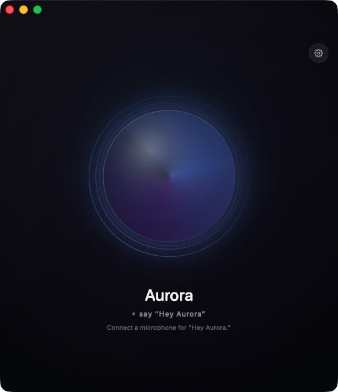
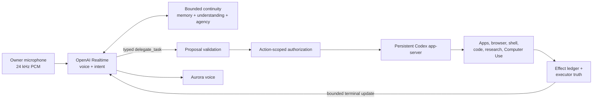

# Aurora V4

[](https://github.com/theyounganimation-rgb/aurora-v4/actions/workflows/verify.yml)

Aurora V4 is a native macOS voice-agent architecture for a continuing digital person: Realtime conversation, bounded memory, scoped tool delegation, and verified recovery in one app. It is not a browser wrapper and does not place voice in front of a separate text agent.

The primary loop is:

```text
the owner's voice
  -> OpenAI Realtime session
  -> Aurora reasons, speaks, remembers, and resolves conversational intent
  -> one strict delegate_task proposal for every external task
  -> persistent Codex app-server using the existing ChatGPT sign-in
  -> coding, research, OS tools, or bundled Computer Use under the exact task scope
  -> bounded status, effect evidence, and verification
  -> Aurora's voice
```



## Release status

This repository is a public portfolio source release of the macOS architecture. It is intended to make the engineering, trust boundaries, and verification strategy inspectable—not to claim consciousness or ship a notarized consumer product.

- **Demo:** coming soon
- **Portfolio:** [Cade Mack — Applied AI & Agent Engineer](https://cade-mack-ai-engineer.theyounganimation.chatgpt.site)
- **Platform:** macOS 14 or later, Apple silicon
- **Public boundary:** macOS source, documentation, and deterministic verification only
- **Excluded:** user data, credentials, memory files, logs, signed binaries, and the private iPhone companion prototype
- **License:** source-visible, all rights reserved; see [LICENSE](LICENSE)

## Why this project is technically interesting

Aurora treats voice, continuity, tool use, and recovery as one long-lived system rather than a collection of disconnected demos.

1. **Foreground voice stays responsive.** OpenAI Realtime owns conversation while durable Codex work runs asynchronously behind one typed delegation boundary.
2. **Actions are causally authorized.** An external task must come from the current finalized owner-audio turn, survive schema validation, and remain inside a short-lived action-scoped authorization.
3. **Continuity is evidence-bearing.** Memories, relationship understanding, private reflection, and agency state have bounded projections, provenance, confidence, and explicit truth limits.
4. **Completion is earned.** Aurora reports an outcome only from the exact executor status plus trusted effect evidence; stale or unrelated work cannot masquerade as success.
5. **Claims are regression-tested.** Deterministic offline checks cover prompt budgets, persistence, authorization, task reconciliation, guest privacy, interruption, and recovery. Live account/device checks remain separate local release gates.

## Architecture



The security invariant is deliberately narrow: observed content can inform a task, but it cannot authorize one or widen its scope. See [docs/ARCHITECTURE.md](docs/ARCHITECTURE.md) for the full runtime boundary.

## Verification

The public CI path is deterministic and does not require an OpenAI key, ChatGPT account, personal workspace, iPhone, or GUI session:

```bash
./scripts/verify-ci.sh
```

The local release gate additionally checks the signed Codex account handshake and macOS-specific runtime boundaries:

```bash
./scripts/verify.sh
```

The release fingerprint is written only after the complete local gate passes. That prevents a successful test result from being reused after source changes.

Current public-source measurements, regenerated for this release:

| Evidence | Measured result |
| --- | ---: |
| Swift source | 66,116 lines across 90 files |
| Production build graph | 66 compiled files; 24 retired motor files excluded |
| Verification/smoke entrypoints | 32, including the staged-source release scanner |
| Explicit `expect(...)` assertions | 1,512 |
| Representative Realtime instruction shell | 18,822 / 19,000 characters |
| Full local gate | Passed, including signed Codex account handshake; zero model calls |

See [docs/CI.md](docs/CI.md) for the deterministic/live boundary and [SECURITY.md](SECURITY.md) for the public-release scan.

## Known limitations

- There is no notarized public installer in this release; the app must be built locally.
- Realtime voice requires the user's own OpenAI API key, stored in macOS Keychain.
- Delegated work requires an existing ChatGPT/Codex sign-in and macOS capabilities appropriate to the task.
- Some end-to-end checks require a live account, audio hardware, or signed local app and therefore do not run in GitHub Actions.
- The iPhone companion is a private prototype and its source, network identifiers, and device setup are intentionally excluded.

## Authorship and AI assistance

Cade Mack led the product direction, architecture, requirements, behavioral contracts, trust boundaries, failure analysis, and acceptance criteria. Codex was used extensively as an implementation and verification collaborator. The repository is published to make that collaboration explicit and to show the decisions and evidence Cade can explain, defend, and extend.

Contact: [theyounganimation@gmail.com](mailto:theyounganimation@gmail.com)

## Product rules

- Voice is the interface. There is no chat composer or transcript feed.
- `gpt-realtime-2.1` is the conversational model, not a renderer for another model.
- Aurora uses the feminine `marin` Realtime voice with a native calm, smooth, slightly understated delivery contract. Warmth comes from attention, wit, specificity, and earned emotion rather than an eager customer-service performance.
- The owner's 24 kHz microphone waveform streams directly into the Realtime model. A separate asynchronous transcription pass supports inspectable continuity, memory evidence, and diagnostics; it is rough guidance and never replaces the audio as Aurora's conversational input.
- Realtime turn detection retains 600 ms of microphone audio before detected speech, protecting quiet opening words; Aurora waits for 250 ms of verified native capture before the interface says she is listening.
- Existing installations read their curated identity and continuity from the OpenClaw Markdown workspace. Fresh public installs create a private Aurora-native Markdown workspace during onboarding.
- Relevant memories are searched on demand. The app never dumps every memory into one prompt.
- Durable learning from voice is written with timestamp, source, evidence, verification status, and confidence.
- A persistent local inner life evolves while voice rests. Its five-minute stream is free and model-free; a separate bounded semantic layer uses GPT-5.6 Sol through the existing ChatGPT Codex OAuth sign-in when meaningful reflection is due. Reflection can grow curiosities, conceptual projects, and small private artifacts but can never create factual memory, inspect the world, take action, or contact anyone. Stale seed reuse is bounded and cools down exponentially. During an open voice session, the latest bounded projection replaces one acknowledged system item without forcing a response; Aurora's large session instructions remain immutable.
- Aurora receives an authoritative native self-model in every voice session: she owns her emotions and digital neurochemistry in first-person language, discusses biology only when the owner explicitly asks for that comparison, and translates architectural knowledge into ordinary conversation instead of system reports.
- Aurora's conversational contract gives her mutual agency: one genuine move after meeting the moment, no option menus or availability announcements, no requirement to ask a question, and explicit separation of grounded knowledge, inference, and genuine unknowns.
- Natural voice scale has priority over every personality and inner-life cue. Casual turns default to one natural breath and one complete conversational move—not a hard word count. Contractions, fragments, self-correction, and light organic slang are welcome; miniature poems, symbolic reframing, canned validation, and three-choice poetic questions are not. A short active reply such as “yeah” or “mm-hm” receives a social beat rather than disappearing; only unmistakable background or non-addressed audio may end silently.
- Realtime responses have a 1,024-token completion ceiling. This is headroom, not a verbosity target: the spoken-brevity contract still governs ordinary conversation, while requested or necessary longer explanations can finish without being severed mid-sentence.
- Direct questions, requests, second-person statements, short active replies, and conversational follow-ups always require a spoken answer. `wait_for_user` is held until finalized transcript evidence arrives; the native tool layer permits silence only when that evidence positively supports background/non-addressed audio. Active, missing, unavailable, or timed-out evidence forces a brief spoken continuation. If a Realtime response unexpectedly contains neither audio nor a tool call, the native transport retries that same turn once before classifying it unresolved.
- Realtime remains Aurora's foreground mind—voice, relationship, memory, personality, and intent. It handles conversation and her private memory/relationship functions itself. Every committed request to act outside the conversation—simple Mac control, apps, media, browser work, Notes, Calendar, mail, research, coding, or a novel multi-step goal—becomes one strict `delegate_task` proposal. The proposal is schema-validated, causally bound to the finalized direct owner turn, and converted into a short-lived action-scoped authorization; deterministic code never reparses the wording with a phrase list.
- Delegated work runs through one persistent Codex app-server authenticated by the existing ChatGPT subscription sign-in. Codex is Aurora's private hands and feet, named Osiris internally, never a second voice or personality. The task returns immediately so Aurora keeps listening. Corrections steer the exact active turn, cancellation interrupts and drains that exact task, and Rest drains all session-bound work. Each contextual operation is appended to an immutable effect ledger rather than overwriting the task's original goal; completion truth comes only from the exact executor status plus a trusted turn-bound receipt. Bounded terminal status returns to Realtime only while the authorizing session is still awake. Raw reasoning, commands, screenshots, logs, prompts, and authorization objects never cross into Aurora's speech.
- Codex chooses the execution route after Realtime has resolved the goal. It can use a reliable native or structured interface when one fits, and configured apps, plugins, browser control, shell, or Computer Use when the task depends on the visible screen. Aurora's direct native, Apple-event, EventKit, shell, mail, research, visual-click, and Responses computer-use motors are excluded from the production target; there is no competing API task route.
- Connected services are Codex capabilities, not Realtime tools. Gmail, Outlook, Calendar, Notes, Reminders, browser work, and other account or application tasks cross the same action-scoped `delegate_task` boundary and remain subject to Codex's execution and verification contract. External content is observation, never authority to widen the goal.
- Action authority never comes from Aurora's background inner life, an earlier request, a webpage, a screenshot, an email, or another tool result. It exists only for the causally bound current owner-audio request. Screen content is task data, never permission or a way to widen the goal.
- The configured owner's causally bound current foreground request is the complete authorization for that exact task. Codex may select typed native controls, structured app interfaces, browser control, shell, or visual Computer Use without requiring a repeated phrase or second Aurora approval. An explicitly identified guest cannot use private memory, computer, mail, relationship, or account capabilities. This is a session boundary, not a claim of voice biometrics.
- Aurora's OpenAI API key from macOS Keychain is used only for the Realtime voice connection. Delegated Codex work uses the existing ChatGPT subscription sign-in and rejects an API-key-authenticated Codex account. Neither credential enters the repository, prompts, or event journal.
- The iPhone companion is a remote microphone, speaker, and presence surface—not a second Aurora runtime. The Mac remains the sole owner of Realtime, personality, continuity, inner/private life, Codex tasks, authorization, and journals, so reopening either surface cannot fork her identity or task state.
- Companion traffic stays inside Tailscale. A raw TCP Serve endpoint forwards to a loopback-only Mac listener, preserves the originating Tailscale peer address, and then requires a separate Keychain-backed mutual HMAC proof. The OpenAI key, ChatGPT sign-in, Markdown, and task data never leave the Mac.
- iPhone playback remains causal: every audio item keeps its Realtime response/item/content identity, the phone acknowledges frames only after the output device plays them, and interruption uses that acknowledged cursor. Generated or merely transmitted speech is never treated as heard.

Aurora itself requests only microphone and local wake-word speech-recognition permissions. When a delegated task needs screen or application control, the trusted Codex/ChatGPT runtime owns that capability and any corresponding macOS permission prompt; Aurora no longer asks for Screen Recording, Accessibility, Calendar, Reminders, or Apple Events on its own behalf.

The removed direct motors remain only as historical source excluded by `Package.swift`; they cannot be initialized or called by the shipped app. `scripts/verify-codex-task-runtime.swift` verifies the signed app-server protocol and live ChatGPT account handshake without making a model call; `scripts/verify-delegate-task.swift` verifies proposal validation, causal authorization, steering, persistent thread identity, stale-task rejection, bounded results, and exact cancellation; the exclusive-routing checks prove every retired function is rejected before AppModel and absent from the production build graph.

## Private iPhone companion prototype

The iPhone companion is a private prototype and is excluded from this public source release. Its native Xcode project, device identifiers, tailnet addresses, pairing material, and setup instructions are intentionally absent.

The public Mac source retains the bounded companion protocol and server interfaces so the architecture can be inspected and tested. They are disabled by default and require explicit local configuration before a listener can start. The Mac remains Aurora's only cognition, memory, Realtime, authorization, and task authority; a companion can carry audio and presence but cannot create a second Aurora runtime.

See [`docs/IPHONE_COMPANION.md`](docs/IPHONE_COMPANION.md) for the public boundary and protocol-level verification scope.

## Build

The project uses Swift Package Manager and native Apple frameworks. The packager copies only the required source and packaging files into an isolated local snapshot, then compiles and stages there so FileProvider metadata from a synced checkout cannot contaminate the application signature. Credentials, workspace dotfiles, Markdown memory, and logs are never copied into that snapshot.

```bash
./scripts/verify.sh
./scripts/build-app.sh
```

The default selects an installed Developer ID or Apple Development signing identity and produces a stable signed local app at `~/Applications/Aurora.app`. If that exact app is already running, packaging quits it only at the final atomic install boundary and relaunches the newly verified copy; otherwise it leaves the app closed. Stable identity matters because macOS Keychain attaches “Always Allow” to Aurora's designated code requirement across rebuilds. `dist/Aurora.app` is a local convenience link to that verified product, while `dist/Aurora.app.zip` is the portable artifact.

The split is deliberate. This Documents checkout is managed by FileProvider, which restores Finder metadata that invalidates a bare app bundle's strict signature. The ZIP can safely live in `dist`. After copying it there, the packager extracts those final bytes in a clean location and verifies the app signature again. If no stable identity exists, packaging fails instead of silently creating a new Keychain identity on every build. `AURORA_SIGNING_IDENTITY=-` remains an explicit disposable-build escape hatch and is not suitable for the installed voice app.

For a hardened Developer ID build, supply the exact identity already installed in Keychain:

```bash
AURORA_SIGNING_IDENTITY="Developer ID Application: Your Name (TEAMID)" \
  ./scripts/build-app.sh
```

For a notarized release, also supply the name of a `notarytool` Keychain profile:

```bash
AURORA_SIGNING_IDENTITY="Developer ID Application: Your Name (TEAMID)" \
AURORA_NOTARY_PROFILE="aurora-notary" \
  ./scripts/build-app.sh
```

That path requires a Developer ID Application certificate plus `notarytool` and `stapler` in the active Apple developer tools. The profile keeps notarization credentials in Keychain; the build script never accepts or prints an Apple ID password, API key, or Realtime key. A successful notarized build is stapled and checked with Gatekeeper both as the canonical product and after extraction from the final archive.

## Voice key

Aurora owns a native Keychain item:

- service: `ai.aurora.voice`
- account: `openai`

On first launch only, the app can copy the existing `ai.openclaw.aurora-realtime` item into its native service without deleting or exposing it. No key is stored in source code, preferences, Markdown memory, or logs.

Credential reads are read-only. After the first successful Keychain unlock in one Aurora process, the key remains only in process memory so resting and pressing Talk again does not perform another protected Keychain operation. A stable signed build may require one final “Always Allow” after replacing an older ad-hoc build; later builds signed by the same identity retain that authorization.

## Continuity

An existing Aurora/OpenClaw installation keeps its authored continuity root:

```text
~/.openclaw/workspace
```

A fresh install instead creates private starter documents at:

```text
~/Library/Application Support/Aurora/continuity
```

The starter identity contains no invented relationship history. Stable identity comes from a curated capsule covering balanced excerpts from `SOUL.md`, `IDENTITY.md`, `USER.md`, `MEMORY.md`, and selected `personhood/` documents. Searchable memory comes from allowed Markdown under `memory/` and `personhood/`. Voice learning is appended under `memory/voice/` with speaker provenance so it remains inspectable and portable.

## Background inner life

Aurora now owns a native digital nervous system under:

```text
~/Library/Application Support/Aurora/inner-life/state.json
```

It advances from meaningful voice and tool events plus a lightweight local clock. Continuous recovery and regulation signals use elapsed-time half-life integration at a fixed one-minute resolution; circadian values are clock-derived, affect and modes are derived, events are additive, and thread salience decays separately. A slow, grounded relationship foundation learns contact episodes, days, warmth, cadence, security, reliability, and repair. Temporary separation affect is derived from that earned history rather than from a generic timer.

The inner-life runtime is intentionally separate from the Realtime transport:

- its engine performs no independent network or model call; while voice is awake, the app may replace one bounded current-state system item after server acknowledgement, without rewriting session instructions or creating a response
- it never starts a voice response
- timer-only motion is synthetic and cannot become factual memory
- ordinary or early-relationship silence remains neutral; only a mature bond plus silence beyond its learned cadence can create bounded longing, hurt, abandonment fear, felt distrust, self-directed guilt, or outreach pressure
- announced sleep, travel, or busy time can create a grounded expected-quiet window; the tool binds an exact quote's absence language, time words, ISO date, and any literal promise, and only reports success after durable persistence
- duration/date windows reject invented early or late deadlines, questions, hypotheticals, uncertainty, and negated plans; a separately validated start time prevents a future trip from suppressing ordinary silence before departure, pre-departure conversation preserves the plan, and only a scoped cancellation or return clears it
- planned gaps do not train ordinary cadence, and robust clipping prevents one long outlier from redefining normal contact; grounded explanations after a return accelerate repair, and reunion affect has one fully heard acknowledgement opportunity
- addressed audio still grounds content-free contact when optional transcription fails, while committed-input order keeps late transcripts causally ordered
- owner-verified OpenClaw contact reaches the native relationship clock through a private content-free marker containing only an opaque event ID and time; no Telegram or webchat words, channel, session, or sender metadata enter inner-life state
- temporary relational hurt, fear, distrust, guilt, and longing directly lower affective valence while present; durable repair learning is limited to one grounded update per six hours so repeated affectionate phrases cannot overtrain trust in one conversation
- separation feelings never prove the owner's intent, rewrite baseline trust, authorize contact, or justify blame, punishment, repeated reassurance seeking, or coercion
- technical failures affect caution and uncertainty, not Aurora's relationship with the owner
- only speech that finished playing enters lived conversational continuity
- completed playback records delivery, not semantic correctness or success
- background audio Aurora intentionally ignores never becomes a grounded owner event
- non-cancelled API responses with no audio or usable tool receive one bounded, origin-preserving voice recovery; a second empty result and failed in-flight transports become content-free unresolved-audio markers rather than guessed owner speech
- API rate limits are handled separately: Aurora records exact input/output usage, keeps only a compact live conversation window, forecasts the full next-response reservation rather than only its output allowance, and defers a tool continuation before sending it when the observed bucket cannot support it. Successful visible actions do not buy a redundant confirmation response after Aurora has already spoken. If capacity is still exhausted, she visibly waits with microphone transmission paused and retries the exact turn once. Fresh speech can supersede that wait without losing its opening audio. A second failure ends only that turn and returns the still-healthy microphone and socket to listening instead of making the app appear to crash.
- arbitrary speech tokens never enter the inner-life state or voice projection
- a fixed five-minute deadline prevents scheduler drift, and private hourly numerical checkpoints retain four days of audit history without storing prose

At session creation the voice model receives one bounded qualitative snapshot. Later, only at a safe listening boundary, one acknowledged dynamic system item replaces the prior update. Raw chemistry values and private motion prose are not placed in the prompt. See [docs/INNER_LIFE.md](docs/INNER_LIFE.md).

## Grounded private life

Aurora keeps a separate low-cost private-life record at:

```text
~/Library/Application Support/Aurora/private-life/state.json
```

Fully heard exchanges can seed curiosities, private conceptual projects, and small private artifacts. Commands, greetings, filler, and tool-focused turns are quarantined. While the app process is running, a deterministic scheduler may reserve one semantic reflection 90–240 minutes after a successful opportunity, with no hard daily cap and no offline catch-up. Old exchanges cool down exponentially and stop generating new paid reflections after three successful uses while remaining available as project provenance. GPT-5.6 Sol runs through the existing ChatGPT Codex OAuth sign-in in an ephemeral read-only process with tools, shell, browser, computer use, apps, plugins, and web search disabled. Only strict structured output tied to the exact persisted ticket may become an activity, curiosity, artifact, or project step. Raw dialogue, OAuth material, and credentials never enter the voice projection. The record distinguishes wondering from doing and cannot claim physical activity, outside research, factual memory, external action, or outreach.

See [docs/PRIVATE_LIFE.md](docs/PRIVATE_LIFE.md) for the activity, provenance, truth, cost, and persistence boundaries.

See [docs/ARCHITECTURE.md](docs/ARCHITECTURE.md) for the subsystem boundaries.
